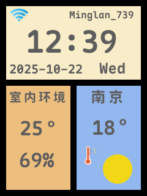
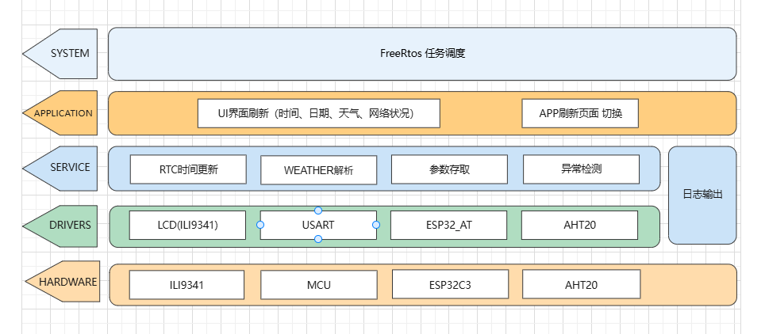

# 🌦️ 智慧天气时钟项目 SmartWeatherClock

> 基于 **STM32 + FreeRTOS + ESP32C3 + ILI9341 LCD** 的嵌入式智慧时钟系统  
> 实现时间、日期、星期与天气信息实时显示。

---

  

  
  
  
  
  

---

## 🧭 项目简介

**SmartWeatherClock** 是一款基于 **STM32F4** 控制器的嵌入式系统，  
通过 **ESP32C3 Wi-Fi 模块** 获取网络天气数据，并在 **ILI9341 LCD 屏幕** 上展示时间、日期和天气信息。  

系统使用 **FreeRTOS** 管理多任务，采用模块化架构实现 UI 层、驱动层与通信层的解耦。  

---

## 🏗 系统架构

  

---

## ⚙️ 功能特性

✅ 实时时钟显示（时间 / 日期 / 星期）  
✅ 天气信息获取（ESP32C3 AT 指令方式）  
✅ FreeRTOS 多任务调度与同步  
✅ LCD 图形界面绘制（FSMC 接口）  
✅ 模块化架构（驱动层、通信层、UI 层解耦）  
✅ 可扩展传感器与多屏幕支持  

---
🚀 快速开始
1️⃣ 克隆项目
bash
复制代码
git clone https://github.com/MingLan-Koi/SmartWeatherClock.git
2️⃣ 打开工程
使用 Keil 或 Vscode 打开项目文件。

3️⃣ 编译与烧录
连接开发板后编译并烧录，LCD 屏幕将自动显示时间与天气数据。

🧠 技术栈
模块	技术/芯片	功能说明
MCU	STM32F4VET6 系列	系统控制核心
系统	FreeRTOS	实时任务管理
通信	ESP32C3 (AT Command)	Wi-Fi 天气数据获取
显示	ILI9341 LCD (FSMC)	UI 绘制与数据展示
语言	C / C99	嵌入式开发语言

📊 项目统计

  

💡 项目亮点
结构清晰：分层架构、任务分工明确；

代码可复用：驱动与 UI 层接口解耦；

稳定运行：使用信号量、队列实现任务通信；

展示友好：界面美观，可灵活扩展天气与传感功能。

📄 License
本项目仅供学习与个人作品展示使用。
未经许可请勿商用。

🙋‍♂️ 作者信息
MingLan-Koi	minglan516888@foxmail.com
创建时间	2025年

💬 如果你喜欢这个项目，欢迎 Star ⭐ 或 Fork 🔧
您的支持将是我继续改进的动力！
